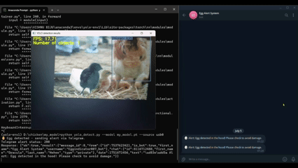

# Chicken and Egg Detection

This project uses the YOLO object detection framework to train a custom model for detecting eggs 🥚 and chickens 🐔 and send realtime alert via telegram bot

  
_(This model doesn’t scramble under pressure.)_

## Deployment

### How to run it locally?

**1. Download the my_model folder**

```bash
  git clone https://github.com/anjsachu/chicken-egg-detection/tree/main/my_model
```

**2. Install Anaconda & Set up virtual environment**

```bash
  conda create --name yolo-env1 python=3.12 -y
  conda activate yolo-env1
```

**3. Install Ultralytics (which also installs import libraries like OpenCV-Python, Numpy, and PyTorch) by issuing the following command:**

```bash
  pip install ultralytics
```

**4. If you have an NVIDIA GPU, you can install the GPU-enabled version of PyTorch by issuing the following command**

```bash
pip install --upgrade torch torchvision torchaudio --index-url https://download.pytorch.org/whl/cu124
```

Take the `my_model.zip` file and unzip it to a folder on your PC. In the Anaconda Prompt terminal, move into the unzipped folder using:

Fill the fields **BOT_TOKEN** &
**CHAT_ID** in the yolo_detect.py file

**5. To run inference with a yolo model on a USB camera at 1280x720 resolution.**

```bash
python yolo_detect.py --model my_model.pt --source usb0 --resolution 1280x720
```
